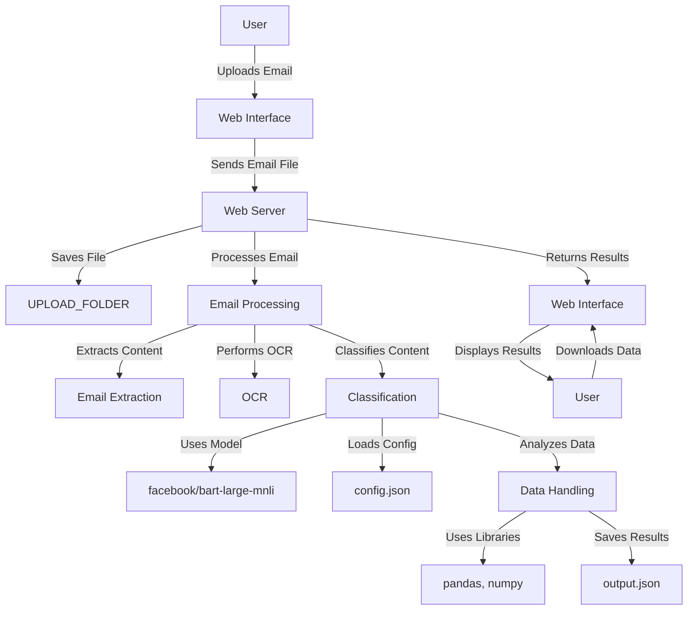

# smart-email-orchestrator

## Overview
The smart-email-orchestrator is a web application designed to classify emails using artificial intelligence techniques. It extracts content from various email formats, processes the data, and classifies it based on predefined categories.

## Project Structure
```
smart-email-orchestrator
├── app
│   ├── __init__.py
│   ├── main.py
│   ├── routes.py
│   ├── models.py
│   ├── utils
│   │   ├── email_extraction.py
│   │   ├── classification.py
│   │   ├── ocr.py
│   │   └── hashing.py
├── templates
│   ├── index.html
│   └── output.html
├── static
│   ├── css
│   │   └── styles.css
│   └── js
│       └── scripts.js
├── requirements.txt
├── config.py
└── README.md
```

## Features
- **Email Extraction**: Extracts content from various email formats.
- **Classification**: Classifies emails based on their content using AI algorithms.
- **Optical Character Recognition (OCR)**: Extracts text from images attached to emails.
- **User Interface**: A simple web interface for users to interact with the application.

## Installation
1. Clone the repository:
   ```
   git clone https://github.com/yourusername/smart-email-orchestrator.git
   ```
2. Navigate to the project directory:
   ```
   cd smart-email-orchestrator
   ```
3. Install the required dependencies:
   ```
   pip install -r requirements.txt
   ```

## Usage
1. Run the application:
   ```
   python app/main.py
   ```
2. Open your web browser and go to `http://localhost:5000` to access the application.

## Introduction
The `smart-email-orchestrator` is a web application designed to classify emails using artificial intelligence techniques. It extracts content from various email formats, processes the data, and classifies it based on predefined categories. This project aims to automate the classification of emails, making it easier to manage and respond to various types of requests.

## Inspiration
The inspiration for this project comes from the need to automate the processing and classification of large volumes of emails. Many organizations receive numerous emails daily, and manually sorting and categorizing them can be time-consuming and error-prone. By leveraging AI and NLP techniques, this project aims to streamline this process, improving efficiency and accuracy.

## What It Does
The `smart-email-orchestrator` performs the following tasks:
- **Email Extraction**: Extracts content from `.eml` files, including the subject, body, and attachments.
- **Classification**: Uses a pre-trained language model to classify emails based on their content into predefined categories.
- **Optical Character Recognition (OCR)**: Extracts text from images attached to emails using OCR.
- **Data Analysis**: Analyzes the extracted data and saves the results in a structured format.
- **User Interface**: Provides a web interface for users to upload emails, view the classification results, and download the processed data.

## How We Built It
The project is built using the following components:
- **Flask**: A lightweight web framework for building the web application.
- **transformers**: A library for natural language processing, used for text classification.
- **Pillow** and **pytesseract**: Libraries for image processing and OCR.
- **pandas** and **numpy**: Libraries for data manipulation and analysis.
- **HTML/CSS/JavaScript**: For the front-end user interface.

### Model Details
The project uses the `facebook/bart-large-mnli` model from the `transformers` library for zero-shot classification. This model is a variant of the BART (Bidirectional and Auto-Regressive Transformers) model, fine-tuned on the Multi-Genre Natural Language Inference (MNLI) dataset. It is capable of performing zero-shot classification, which means it can classify text into categories it has not seen during training.

The classification pipeline is initialized as follows:
```python
from transformers import pipeline

# Initialize the text classification pipeline
classifier = pipeline("zero-shot-classification", model="facebook/bart-large-mnli")
```

The `classify_email` function uses this pipeline to classify the content of emails into predefined categories and subcategories based on the configuration provided in `config.json`.

## Challenges We Faced
Some of the challenges we faced during the development of this project include:
- **Handling Different Email Formats**: Emails can come in various formats and encodings, making it challenging to extract content consistently.
- **Text Classification Accuracy**: Ensuring the accuracy of the text classification model required fine-tuning and testing with different datasets.
- **OCR Performance**: Extracting text from images with varying quality and content required optimizing the OCR process.
- **Integration of Components**: Integrating different components, such as the web interface, email processing, and classification, required careful coordination and testing.

## How to Run
To run the `smart-email-orchestrator` project, follow these steps:

1. **Clone the repository**:
   ```sh
   git clone https://github.com/yourusername/smart-email-orchestrator.git
   ```

2. **Navigate to the project directory**:
   ```sh
   cd smart-email-orchestrator
   ```

3. **Install the required dependencies**:
   ```sh
   pip install -r requirements.txt
   ```

4. **Run the application**:
   ```sh
   python app/main.py
   ```

5. **Open your web browser and go to** `http://localhost:5000` **to access the application**.

## Tech Stack
The project uses the following technologies:
- **Flask**: For building the web application and handling HTTP requests.
- **transformers**: For natural language processing and text classification.
- **Pillow** and **pytesseract**: For image processing and OCR.
- **pandas** and **numpy**: For data manipulation and analysis.
- **HTML/CSS/JavaScript**: For the front-end user interface.
- **Bootstrap**: For responsive and modern web design.
- **DataTables**: For displaying and managing tabular data in the web interface.

## Contributing
Contributions are welcome! Please open an issue or submit a pull request for any enhancements or bug fixes.

## License
This project is licensed under the MIT License - see the LICENSE file for details.

## High-Level Architecture

### Components

1. **Web Interface (Frontend)**
   - **HTML/CSS/JavaScript**: Provides the user interface for uploading emails, viewing classification results, and downloading processed data.
   - **Bootstrap**: Ensures a responsive and modern design.
   - **DataTables**: Manages and displays tabular data.

2. **Web Server (Backend)**
   - **Flask**: Handles HTTP requests, routes, and serves the web interface.
   - **Routes**: Defines endpoints for uploading emails, processing data, and returning results.

3. **Email Processing**
   - **Email Extraction**: Extracts content from `.eml` files, including the subject, body, and attachments.
   - **OCR (Optical Character Recognition)**: Uses `pytesseract` and `Pillow` to extract text from images attached to emails.

4. **Classification**
   - **Zero-Shot Classification**: Uses the `facebook/bart-large-mnli` model from the `transformers` library to classify email content into predefined categories and subcategories.
   - **Configuration**: Loads classification categories and subcategories from `config.json`.

5. **Data Handling**
   - **pandas** and **numpy**: Manipulates and analyzes the extracted and classified data.
   - **Output**: Saves the processed data in a structured format (e.g., JSON).

### Data Flow

1. **User Interaction**
   - The user accesses the web interface through a browser.
   - The user uploads an email file via the web interface.

2. **Email Upload**
   - The uploaded email file is sent to the Flask backend via an HTTP POST request.
   - The file is saved to the `UPLOAD_FOLDER`.

3. **Email Processing**
   - The backend extracts the content from the uploaded email file.
   - If the email contains image attachments, OCR is performed to extract text from the images.

4. **Classification**
   - The extracted email content is passed to the zero-shot classification pipeline.
   - The `facebook/bart-large-mnli` model classifies the content into predefined categories and subcategories based on the configuration.

5. **Data Analysis and Output**
   - The classified data is analyzed and structured using `pandas` and `numpy`.
   - The results are saved in a JSON file (`output.json`) and/or displayed on the web interface.

6. **User Interaction**
   - The user can view the classification results on the web interface.
   - The user can download the processed data.

### High-Level Diagram



